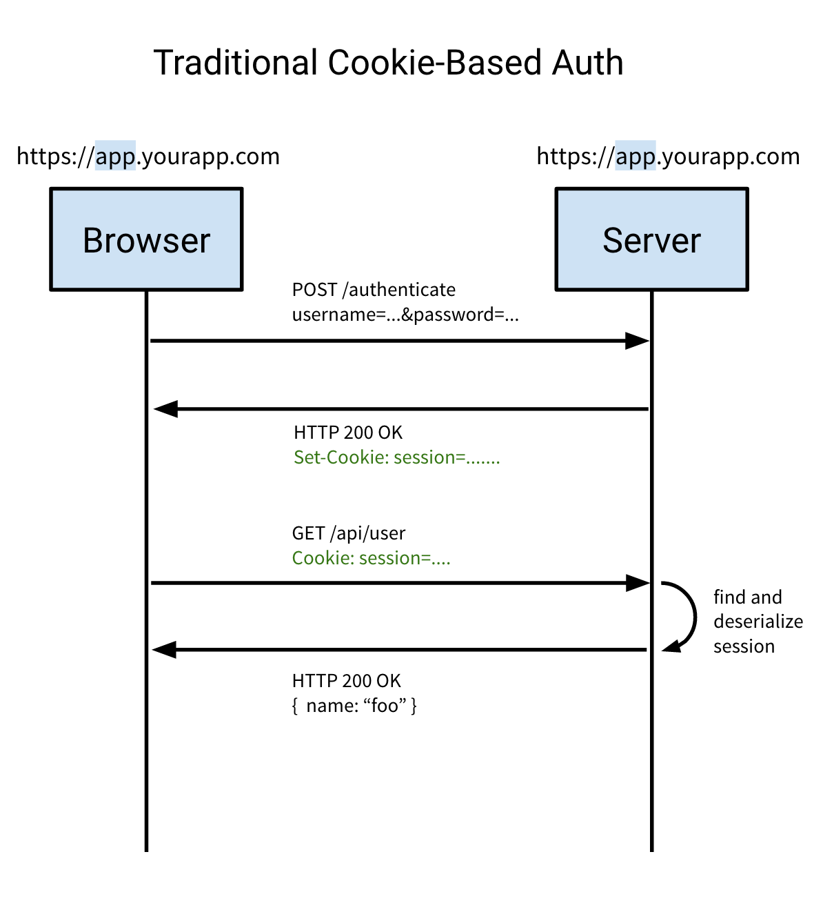
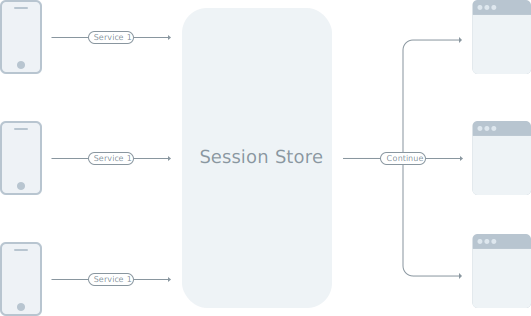
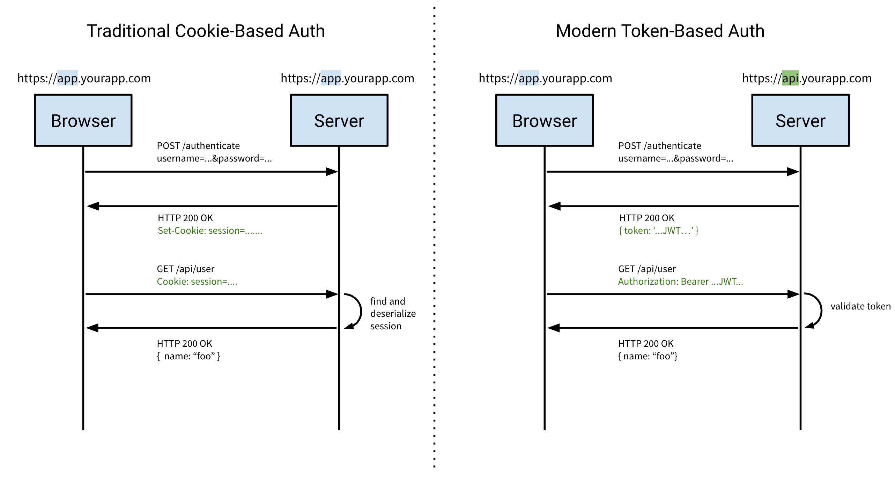
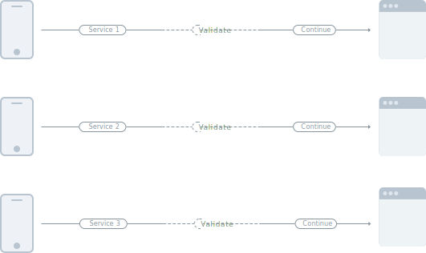

2 years have passed since my last blog post and a quite a bit has changed. Today, the term "microservice" is ever more present and aims to fix what SOA promised back in the days when vendors tried to shove Enterprise Service Busses in company's tech stacks. (But that's a whole other discussion.)

Back to the topic at hand, I gave a talk about a year ago about how you could solve authentication in a distributed (microservices) world without sacrificing performance or availability using JWT tokens.

This article is pretty much a writeup of what I talked about back then, I decided to write it all down given the recent interest of the engineers I've met on the subject.

# Session based authentication
To understand the problem, let's take a look at the current authentication landscape and how it won't work well in a distributed environment.

Authentication is often achieved using cookies, which usually means session-based authentication. This means that session identifiers are stored somewhere in a session store such as SQL, Redis, Disk, … I've seen quite a few.

Let's take a look at how that works.

Source: [https://auth0.com/blog/cookies-vs-tokens-definitive-guide/](https://auth0.com/blog/cookies-vs-tokens-definitive-guide/)

1. The user tries to authenticate with the server by sending a username and a password to the server on the same domain (since cookies are scoped to a specific domain).

2. When successful, the server responds with the `Set-Cookie` header, instructing the browser to store the contents of the header in a cookie. This is usually the session identifier.

3. Whenever the user makes a request to the backend, the browser will automatically include all cookies related to the domain in the request.

4. The server will then lookup the session information based on the session identifier, deserialize it, do a database lookup for more user information if needed and continue with its backend logic and ultimately send its response over to the client.

Consider the fact that a lot of unique users want to interact with your application, they will all send requests to your backend and hope to receive a response within an acceptable timeframe.

Requests come in in a asynchronous fashion, but since the session store is (usually) synchronous, the egress traffic of the store is synchronous, which means the clients will receive the response one at a time.

As you can see, using a session store is not very scalable. The more clients interact with your system, the harder it will become to scale your session store to handle the number of concurrent requests.

Furthermore, your session store is now your SPOF ([Single Point of Failure](https://en.wikipedia.org/wiki/Single_point_of_failure)) which means that if it goes down, your entire service architecture goes down with it, resulting in client request failures.

Now, let's look at this with microservices in mind. There are a few apparent issues here.

1. A cookie is scoped to a single domain, not including subdomains.

    This makes it difficult to truly scale your services. Since everything needs to be handled from the same domain, you will likely need a reverse proxy to handle the requests and forward those to the correct service internally, which creates a huge dependency on that reverse proxy and introduces another SPOF.

2. The session store is (usually) synchronous

    A recap from what I stated previously, the session store that manages sessions and handles additional database lookups is usually synchronous which means that no matter how many clients make requests at the same time, they will all have to wait for other requests to be fulfilled before they can be served.

    Do note that you can however architect your session store to be more performant, but it will cost you a lot of time and resources, which ultimately leads to a lot of money being thrown around.

## Token based authentication
Now that we've taken a look at session based authentication and why this won't scale when thinking in terms of microservices it's time to look at how we would tackle this problem and make it scale across services.

First, we need to get rid of the SPOFs. Remember that we had 2 potential SPOF candidates.

1. Reverse proxy server:
To keep it all inside a single domain for cookies to work properly
2. Session store:
To lookup user data based on a unique session identifier
(e.g. name, email, permissions, etc.)

Now, before we continue it's best to explain what JWT tokens are and how they can help us with our problem.

---

Let's look at JWT tokens in contrast to cookies.

Source: [https://auth0.com/blog/cookies-vs-tokens-definitive-guide/](https://auth0.com/blog/cookies-vs-tokens-definitive-guide/)

Cookie-based authentication on the left (repeated from earlier), Token-based authentication on the right (new).

1. The client makes an authentication request with a payload of both a username and password, nothing has changed here.

    However, note that with token-based authentication you are not limited to a single domain, which is very powerful in terms of scalability.

2. When successful, the server will respond with the token in the response **body**, this is different from the `Set-Cookie` header when using cookies.

    Note that your client will have to be able to store this token somewhere since we're no longer relying on the browser to send the cookie automatically with each request.

3. As previously stated, the client (browser) will no longer automatically send the cookie along with each request to the server so we need to pass the token in the header.

    This is typically set in the `Authorization` header using the `Bearer` schema.

    `Authorization: Bearer …`

4. The server validates the token and once validated accepts the token content as truth and continues with its operation.

    Note here that not a single lookup needs to happen, no unique session lookup, no database query, simply token validation ([HMAC](https://en.wikipedia.org/wiki/Hash-based_message_authentication_code) digest comparison).

Again, let's look at this from a microservices point of view.

1. You immediately notice that the session store is completely gone and has been replaced by simple token validation in the service itself. This removes one of our SPOFs and in addition improves throughput since we no longer have any blocking calls in our service architecture. Win!

2. Remember our second potential SPOF?
    The reverse-proxy was needed in order to keep all our endpoints on the same domain, so if the reverse-proxy goes down, all ingress traffic to our services goes down with it.

    Now, with token based authentication we are no longer bound to a single domain, removing the need for a reverse-proxy server.

    This allows our services to work independently of one another, but most importantly *fail* independently of one another.

Make no illusions, the path towards microservices is not as easy as you'd think. Services **will** fail, but that is a fact that must be embraced and incorporated into your development team's mentality.

# Security
Let's talk a bit about security. As software engineers I believe we all have a shared responsibility to keep everything as secure as possible.

## 1. Always serve your traffic securely over TLS

No exceptions and no excuses, protecting your user's data over the internet should be a top priority.

Related to this, you should note that JWT tokens are signed, not encrypted. Although you *can* [encrypt tokens](https://tools.ietf.org/html/rfc7516). Anything you store inside a token can be read by the client, therefore you cannot store sensitive data such as passwords or other secrets.

You may however store user-specific data such as email address, permissions, basically anything that the user is allowed to see as long as you serve your content over HTTPS. TLS here is crucial, a simple MITM attack can lead to [session hijacking](https://www.owasp.org/index.php/Session_hijacking_attack).

## 2. JWT Tokens support asymmetric keys
In contrast to symmetric keys (shared secret), using asymmetric keys allow you to improve your JWT signing security by having both a private and a public key.

Using a symmetric key, all services would have the same key to both sign and verify a token. This would mean that if a single service is compromised, an attacker would have to key to sign its own tokens which means your entire service infrastructure would be compromised.

Using asymmetric keys, only the "authentication" service would need the private key to sign tokens, all other services only need the public key to verify the tokens. In this scenario of one of the other services were breached, all the attacker would have is the public key which is public anyway and isn't really worth anything.

This way, you would only have to secure the private key used by the "authentication" service, which is far more manageable.

## 3. XSS vs. CSRF
Where cookies are vulnerable to [CSRF attacks](https://www.owasp.org/index.php/Cross-Site_Request_Forgery_(CSRF)), JWT tokens are vulnerable to [XSS attacks](https://www.owasp.org/index.php/Cross-site_Scripting_%28XSS%29), which is actually easier to mitigate.

I won't go into details here, but know that a simple injected javascript could simply read from a user's localStorage and send the contents over to an attacker's server, which means the attacker basically used a [session hijack attack](https://www.owasp.org/index.php/Session_hijacking_attack).

This can easily be mitigated using [Content Security Policy](https://developers.google.com/web/fundamentals/security/csp/), by whitelisting your origins.

## 4. Always verify the JWT token algorithm
A vulnerability was found in certain library implementations, a great writeup is available on [Auth0's blog](https://auth0.com/blog/critical-vulnerabilities-in-json-web-token-libraries/).

In short, always make sure on the server-side that the JWT token's algorithm is the algorithm that your are expecting, otherwise an attacker can use the `none` algorithm to circumvent token validation.

# Thoughts
Hopefully, I've made it clear how JWT tokens can be used along with microservices to improve scalability of your application by removing SPOFs and allowing your application to run more distributed.

Keep in mind that in order to ship microservices into production you would need a whole lot more than what I've talked about today. However, I would like to keep that for another article.

If you have any thoughts on how to improve this article or are interested in talking about scalability or high availability, you can find me on [Twitter](https://twitter.com/MichielDeMey) or if you're in the neighbourhood I'm always available for a ☕️.
