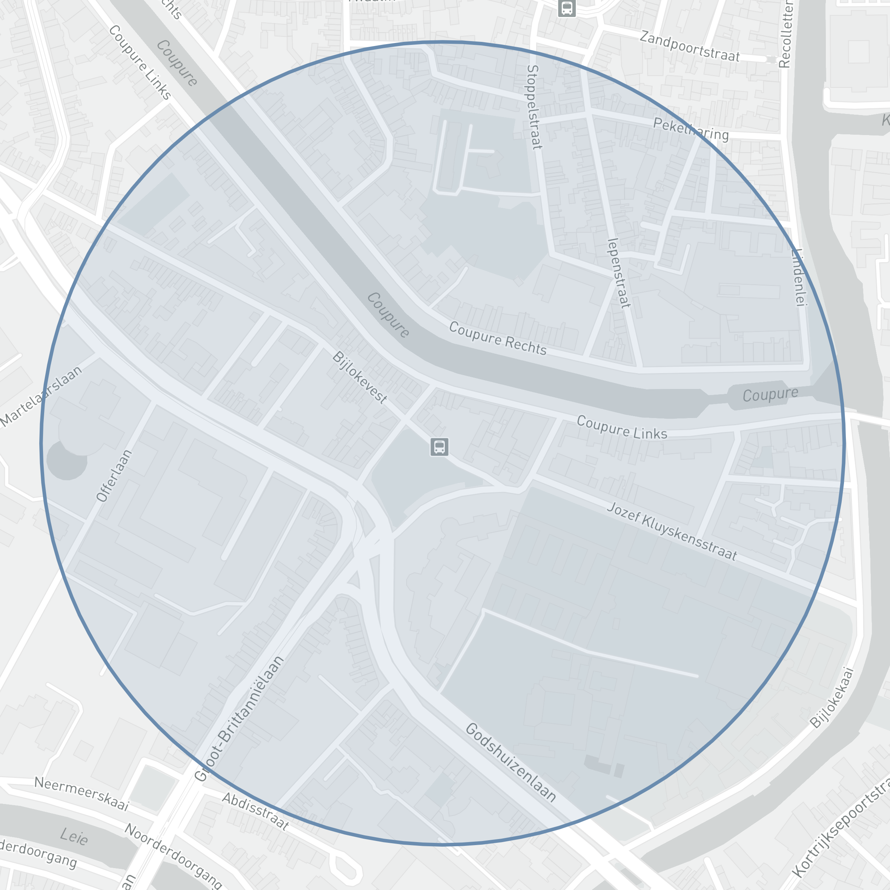
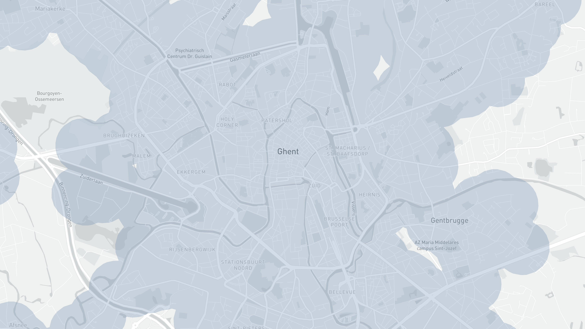
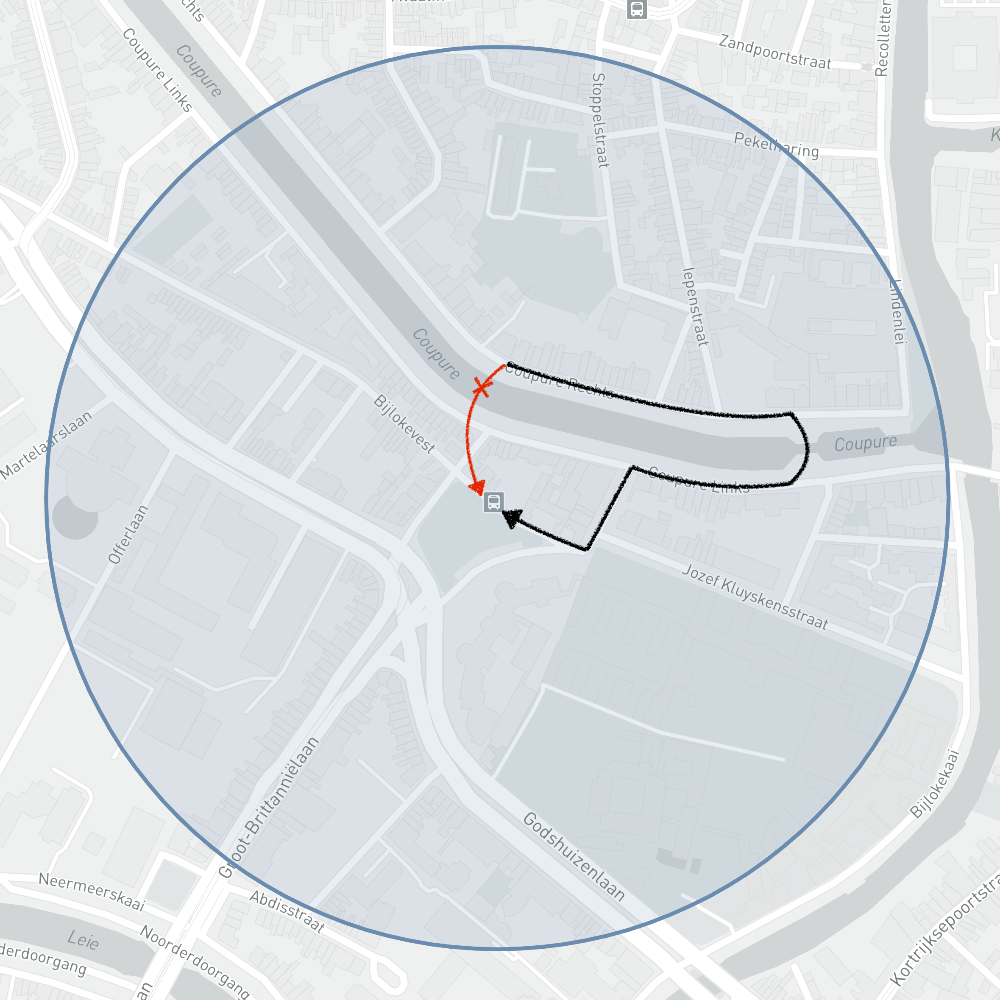
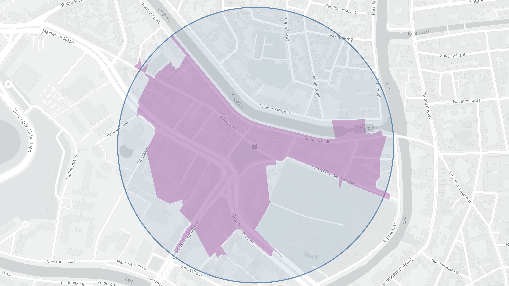

> How many people live within a 5 minute walk from a bus stop?

A seemingly simple question, yet one that requires a bit more thought and consideration as well as processing power. Let's try and visualize our solution to get a better understanding of the problems we might face when trying to provide our solution.

# The naive method
Taking into account that the average person's walking speed is around 4 to 5km/h.
If my math adds up (`distance = speed x time`), the average person can walk up to `375m = (5m/60) x 4500m/s` in 5 minutes.

So let's draw a circle with a radius of 375m around a bus stop in Ghent.

Theoretically, everyone living inside of the circle should be able to reach the bus stop within a 5 minute walk.

This is in fact how "De Lijn" — the local bus operator — decided to calculate their coverage map for Antwerp as you can see on [Open Data Antwerpen](http://portaal-stadantwerpen.opendata.arcgis.com/datasets/bereik-ov-halte-buurt/data?geometry=3.859%2C51.152%2C4.969%2C51.302&orderBy=OBJECTID&where=type%20%3D%20%27bushalte%27%20AND%20OBJECTID%20%3E%3D%201423%20AND%20OBJECTID%20%3C%3D%201423).

If we visualize this method on top of Ghent, it will look like this.

At first glance, this looks great, everyone living in the city has a bus stop within a 5-minute walking distance.

In practice however, we will see that this method of coverage calculation is far from accurate.

# Where it fails

Let's examine a realistic scenario.

Assume you live on "Coupure Rechts" and want to take the closest bus stop at "Bijlokevest". The fastest way to the bus stop would be to go in a straight line. Unfortunately, you cannot simply swim across the canal, instead forcing you to take the nearest bridge, losing precious time taking the long way around.

As you can probably guess, the walk to the bus stop might take quite a bit longer than 5 minutes.

# More accurate method
So we talked about the naive method — which is simply drawing a circle with a specific radius around a geospatial point — but what would a realistic representation look like?

For these types of reachability problems it's best to look at [isochrones](https://wiki.openstreetmap.org/wiki/Isochrone) to visualize the actual reachability. In short, an isochrone is really just an isoline for travel time.

Under the hood, we will be using a routing engine with the capability to calculate travel times from point A to point B using a [shortest path tree](https://en.wikipedia.org/wiki/Shortest-path_tree) (SPT) algorithm. We then create an [alpha shape](https://en.wikipedia.org/wiki/Alpha_shape) (concave hull) to create a polygon to visually represent reachability.

As we can see from the comparison image, the isochrone generated from the walking distance calculation gives a much more accurate visualization of the actual reachability of that specific bus stop. It correctly visualizes that "Coupure Rechts" is not reachable within the defined 5-minute walking distance, nor any other streets at the other side of the canal except for the very few houses across to the bridge.

# Final thoughts
If we overlay both the naive method and the more accurate isochrones method on top of Ghent we can clearly see a difference in total coverage.

<iframe frameBorder="0" width="500" height="500" src="https://api.mapbox.com/styles/v1/michieldemey/ck6tr50uw0xpy1is0vu9k4nvf.html?fresh=true&title=false&zoomwheel=false&access_token=pk.eyJ1IjoibWljaGllbGRlbWV5IiwiYSI6ImNGcVByV1EifQ.iM9H-e2tB6MzycvLMXJOMw#12.51/51.04457/3.71517"></iframe>

Furthermore, reachability gaps start to show within the city. This is exactly the kind of visualization we want to see since it now allows you to focus on those gaps which allows urban planners to optimize their overall service and bring customer satisfaction in terms of reachability to the next level.

There are many optimizations that can be made for the isochrone visualization, such as overlaying population density and filtering landmass and non-habitable areas to make a better informed decision on urban planning but I believe that this is a great start towards a more accurate visualization of reachability.

Furthermore, using isochrones does not only improve reachability problems on a micro scale, but on a macro scale as well. Frank Rowe has [a great article](http://frankrowe.org/posts/2019/2/13/use-isochrones.html) on this topic as well.

---

# Technical information
If you're interested in how I created these visualizations, feel free to send me a Tweet [@MichielDeMey](https://twitter.com/MichielDeMey).

## Datasets

Name | Description
---- | ----
[De Lijn Bus stops in Belgium](https://opendata.vlaanderen.be/dataset/haltes-vlaamse-vervoersmaatschappij-de-lijn-toestand-27-01-2020/resource/103f51b5-5510-40bf-a3a6-329531d5003f) | Geoset of all De Lijn bus stops in Belgium
[Official borders of Ghent](https://datatank.stad.gent/4/grondgebied/grenzengent) | Used to filter bus stops for Ghent
[OpenStreetMap dataset of Belgium](https://download.geofabrik.de/europe/belgium.html) | Used by OSRM

## Tools
Name | Description
---- | ----
[OSRM](https://github.com/Project-OSRM/osrm-backend) | Modern C++ routing engine for shortest paths in road networks
[Turf.js](https://turfjs.org/) | Advanced geospatial analysis
[Mapshaper](https://github.com/mbloch/mapshaper) | Tools for editing Shapefile, GeoJSON, TopoJSON and CSV files
[Mapbox](https://www.mapbox.com/) | Mapping tools for developers

