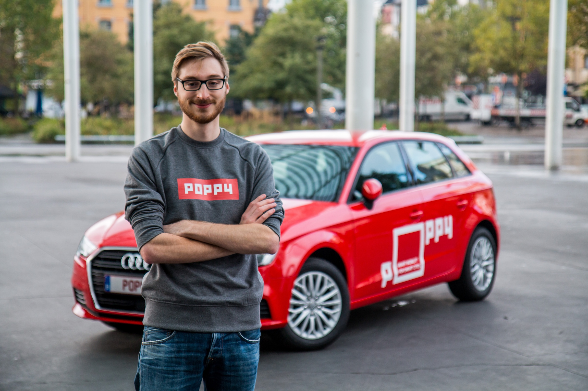

{{}}

You know, I've always been a sucker for Start-ups, I've worked in the start-up scene my entire career. From the beautiful beaches of San Francisco to the fancy docks of Ghent to the busy streets of Antwerp.

FLAVR, my latest start-up adventure in the food tech was special. Special in the sense that I really felt connected to the company, its mission and its community. The sort of connection that you feel when the news of restructuring the company hits you.

I know it must have been a difficult decision to make, but I understand the issues we were facing and I support their decision. Looking back at my time at FLAVR I have nothing but great memories.

We had a great team, an amazing team. Everything we did, we did with conviction and dedication. It's wasn't all work however. Laughs were had, Nerf guns were shot, features were delivered, but most of all chefs and users alike were happy and enthusiastic about the platform we built.

It's the first time I came into contact with a B2C (Business to Consumer) start-up and I fell in love with the power of a community. The positive vibe of the chefs really made the experience all the better. Knowing that I helped contribute towards helping our chefs and our users brings great joy.

Now — a few months later — looking at the analytics dashboard that I built I can see the platform continues to grow organically, proud once more that the software we built is still powering this great community and will continue to do so in the future.

---

You only go into the start-up scene if you're looking for an adventure. Uncertainty is what drives you, keeps you on your toes. It keeps you from doing what is "easy" and forces you to do what is "right".

I'm not done with the start-up scene yet. On the contrary, I'm eager and ready to start working on something new.

**Poppy**

A new start-up that will focus on improving and modernising mobility — a basic human necessity — by offering a 'free floating car sharing' solution.

As a frequent commuter, I see my daily share of mobility problems.
Train delays, air pollution, traffic jams, expensive parking. The list goes on.

These problems aren't in any way "new" problems, but we at Poppy are committed to finding a great solution to some of these problems through technology and by providing great services all around.

Problems that we will solve as a team. I'm really happy to say that I'll be joining **Alexander** and **Moos**, founders of FLAVR and **Niels**, former co-founder and CEO of Conversation Starter as their Head of Engineering in their new (ad)venture. Not just as a colleague, but as a friend.

It's an ambitious project, but we won't be doing it solo. Poppy will be teaming up with D'Ieteren through a corporate venture. The flexibility and speed of a start-up with the power and resources of a corporate.

Together, we will deploy 350 cars, in and around Antwerp.
A mixed fleet of 100% electric Volkswagen e-Golf and Audi A3 g-tron (powered by natural gas-CNG), to reduce the city's carbon footprint and electric charging infrastructure.

You'll be hearing more of us in the near future, a future we're looking to be a part of.

---

Poppy press article:
[English](https://poppy.be/pressrelease) / [Dutch](https://poppy.be/persbericht) / [French](https://poppy.be/communiquedepresse)

More awesome blogposts from our team:
[Alexander’s blogpost](https://medium.com/@Alexandervanlaer/our-start-up-flavr-evolved-and-so-did-we-92f4af946d39) / [Niels’ blogpost](https://medium.com/@niels.peetermans/a-new-chapter-from-events-to-mobility-4da847cdedd2)
